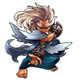

[参考链接](https://www.extlight.com/2017/12/04/%E7%AE%80%E5%8D%95%E5%AE%9E%E7%8E%B0-3D-%E7%9B%B8%E5%86%8C/)

修改如下：

- 使用ES6语法实现该效果；
- 增加注释；

# # 概述

下面简单介绍本章需要实现的 3D 效果：

当加载页面后，图片展示“摊牌”的效果，当鼠标点击页面左滑动或者右滑动时，图片会跟随左旋转或右旋转。当鼠标点击页面上滑动或下滑动时，可以改变观察图片的角度。


# # 布局

```html
<!DOCTYPE html>
<html lang="zh-cn">
<head>
    <meta charset="UTF-8">
    <title>3D相册</title>
    <link rel="stylesheet" href="css/index.css">
</head>
<body>


<div class="container">
    <div id="wrap" class="img-wrap">
        
        
        
        
        
        
        
        
        
        
        
    </div>
</div>


<script type="text/javascript" src="js/index.js"></script>
</body>
</html>
```

没有样式的效果


# # 样式

```css
@charset "UTF-8";

* {
    margin: 0; padding: 0;
}

body {
    background: #000;
}

.container {
    perspective: 1500px;
}

.img-wrap {
    width:  100px;
    height: 100px;
    margin: 150px auto;
    position: relative;
    
    transform-style: preserve-3d;
    -webkit-transform: rotateX(-20deg);
    -moz-transform: rotateX(-20deg);
    -ms-transform: rotateX(-20deg);
    -o-transform: rotateX(-20deg);
    transform: rotateX(-20deg);
}


.img-wrap > img {
    position: absolute;
    -webkit-box-shadow: 0 0 8px #eee;
    -moz-box-shadow: 0 0 8px #eee;
    box-shadow: 0 0 8px #eee;
}
```

添加样式后的效果如下：


图片被设置 position: absolute; 后，所有图片重叠在一起了。

# # 交互

从演示图中我们可以看出，3D 效果可以分 2 个步骤：摊牌效果和图片旋转效果。

## 1、摊牌效果

所有图片分摊 360 度，设置其旋转角度即可。

```javascript
/**
 * 1.摊牌效果
 */
let oImgWrap = document.querySelector("#wrap");
let oImgs    = document.querySelectorAll("#wrap > img");
let leng     = oImgs.length;
let deg      = 360 / leng;

for(let i = 0; i < leng; i++) {
    oImgs[i].style.transform = `rotateY(${deg * i}deg) translateZ(250px)`;
    oImgs[leng - i - 1].style.transition = `all 1s linear ${.2 * i}s`;
}
```

效果演示：


## 2、旋转效果

实现图片旋转效果，只要改变中心轴的旋转角度即可。

```javascript
/**
 * 2、旋转效果
 */
// 点击坐标
let clickX, clickY;
// 移动坐标
let moveX, moveY;
// 移动距离
let minusX, minusY;
// 旋转角度
let rotateX =  0,
    rotateY = -20; // 由于让Y默认偏移-20deg，因此在设置默认值的时候应该赋值为-20；
// 定时器
let timer = null;
// 鼠标按下事件
window.onmousedown = function (e) {
    // 兼容IE
    e = e || event;
    // 更新鼠标位置
    clickX = e.clientX;
    clickY = e.clientY;

    // 鼠标移动事件
    this.onmousemove = function (e) {
        e = e || event;
        // 更新鼠标移动的位置
        moveX = e.clientX;
        moveY = e.clientY;
        // 更新鼠标移动的距离
        minusX = moveX - clickX;
        minusY = moveY - clickY;
        // 旋转角度，避免旋转太快，故 *0.1
        rotateX += minusX * 0.1;
        rotateY -= minusY * 0.1;
        // 中心物体旋转
        oImgWrap.style.transform = `rotateX(${rotateY}deg) rotateY(${rotateX}deg)`;
        // 更新鼠标位置
        clickX = moveX;
        clickY = moveY;
    }
    // 鼠标释放
    this.onmouseup = function () {
        // 清除鼠标移动事件
        this.onmousemove = null;
        // 旋转惯性
        timer = setInterval(function () {
            minusX *= 0.99;
            minusY *= 0.99;
            rotateX += minusX * 0.1;
            rotateY -= minusY * 0.1;
            oImgWrap.style.transform = `rotateX(${rotateY}deg) rotateY(${rotateX}deg)`;
            if(Math.abs(minusX) < 0.1 && Math.abs(minusY) < 0.1) {
                clearInterval(timer);
            }
        }, 10);
    }
}
```


